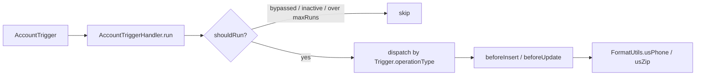

# Apex Trigger Framework

[](https://github.com/Mounika-Mangiri/Apex-trigger-framework/actions/workflows/ci.yml)

A small, dependency-free trigger handler framework for Salesforce: one trigger per object, one handler class per object, plus a kill switch, a bypass API and a loop breaker. Includes an Account handler that normalizes U.S. phone numbers and ZIP codes.

> **Representative portfolio project.** Written independently to show the trigger patterns used on enterprise orgs. It contains no employer or client code. The design follows widely used open patterns (one trigger per object, handler base class, custom-metadata switches).

## Business problem

Large orgs end up with many triggers per object, logic that fires in an unpredictable order, recursion when one update causes another, and no safe way to switch logic off during a data load or production incident without a deployment. This framework gives every object the same predictable structure.

## Features

| Feature | How it works |
| --- | --- |
| One trigger per object | `AccountTrigger` only calls `new AccountTriggerHandler().run()` |
| Override only what you need | Seven `protected virtual` hooks (`beforeInsert` ... `afterUndelete`) |
| Production kill switch | `Trigger_Setting__mdt` record named after the handler; uncheck **Is Active** in Setup |
| Bypass for data loads / nested DML | `TriggerHandler.bypass('AccountTriggerHandler')` and `clearBypass(...)` |
| Loop breaker | Each handler runs at most `maxRuns` (default 10) times per event per transaction |
| Bulk-safe example | Handler works on the full `Trigger.new` list; test inserts 200 records |



## Usage

```apex
// 1. Trigger: one per object, every event, no logic
trigger ContactTrigger on Contact(before insert, before update, after insert, after update) {
  new ContactTriggerHandler().run();
}

// 2. Handler: override only the events you need
public with sharing class ContactTriggerHandler extends TriggerHandler {
  protected override void beforeInsert(List<SObject> records) {
    // ...
  }
}

// 3. Data load without side effects
TriggerHandler.bypass('ContactTriggerHandler');
insert contactsFromLegacySystem;
TriggerHandler.clearBypass('ContactTriggerHandler');
```

## Run it

```bash
npm install
npm run prettier:check     # the Apex plugin parses every class and trigger
sf org create scratch --definition-file config/project-scratch-def.json --alias tf --set-default
sf project deploy start
sf apex run test --code-coverage --result-format human --wait 20
```

## Tests

CI runs on every push: Prettier (parses every Apex class and trigger) and PMD static analysis. The `apex-tests` job deploys to a scratch org and runs the Apex tests below only when a Dev Hub auth URL is saved as the `SFDX_AUTH_URL` repository secret; until then it is skipped.

| Suite | Count | Covers |
| --- | --- | --- |
| `TriggerHandlerTest` | 5 | all seven operations dispatch, bypass, kill switch, loop breaker, no-op outside a trigger |
| `AccountTriggerHandlerTest` | 3 | insert and update normalization, bypass, 200-record bulk insert |
| `FormatUtilsTest` | 2 | U.S. and non-U.S. phone and postal formats |

## Design choices

- **No static Boolean "run once" flag.** It silently skips legitimate second updates in the same transaction (for example a workflow field update). A counter with a ceiling stops runaway loops without that side effect.
- **Missing setting means active.** New handlers work without a metadata record; the record is only needed to switch one off.
- **Pure helpers.** Formatting lives in `FormatUtils` so it can be unit-tested without DML.
- **Unrecognized values are left alone** rather than guessed at (international numbers, partial ZIPs).

## Limitations and next steps

- Per-handler, not per-record, loop counting.
- No ordering between multiple handlers on one object; add a handler list in custom metadata if needed.
- Could add a `Trigger_Setting__mdt` field per operation for finer switches.

## Credits

Designed and maintained by Mounika M. Code drafted with AI assistance and reviewed by the author. Licensed under MIT.
